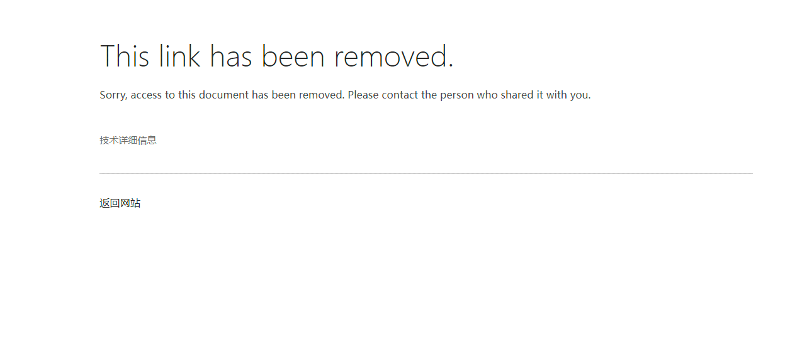
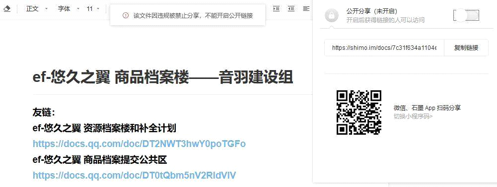

# Changelog

# 2024
## 2024-04-16
基于SFM相同原因，补充FFD硬盘版

毒盘文件结构调整：将原属于`EF游戏原版【日文】`文件夹的`FFD+SFM`文件夹放入`EF游戏demo相关`文件夹，再将后者合并进`EF游戏原版【日文】`文件夹

## 2024-04-15
发现SFM镜像版安装需要验证实体光盘，遂补充上传了本人重新提取的硬盘版

## 2024-02-01
迁移资源档案楼文档至git，感谢妖梦协助将doc转化md

## 2024-01-30
修改原地tp地址为暂时发布页

# 2023

## 2023-12-01
1. 由于秒传似了，所以度盘还活着的链接只能说且用且珍惜吧，很大概率不会再补档了；本文档内的相关说明也进行了更新，总之仅作为资源目录展示了。

2. 优化本文档排版。

## 2023-04-08
Tsdm有人问我有没有其他整理，姑且本文目录开了个第8部分了，感兴趣自寻

## 2023-01-04
修复本文档离奇失踪bug：昨天更新文档版本时错误地使用了本地文档进行覆盖，导致原文件断链。

# 2022

## 2022-01-03
修正【除OST外部分】的毒盘提取码

# 2021

## 2021-11-12
1. 更新本文档内秒传指引版本
2. Cover \[リア獣ハンター優子 everlasting
force\]【修图LemonCraft@tsdm】.jpg

## 2021-08-07
老是隔三差五被举报。。。只能转移OD了，上不来的话自行搭梯子

## 2021-04-18
CG文件夹的日曜日炸了，修改md5后重新上传至OD和毒盘，并将链接替换成秒传@devil

## 2021-02-03
\[EAC\]\[10xxxx\]\[Drama
CD\]\[minori\]ドラマCD「お年賀ニ〇一〇」(3bk)@devil

minori登録ユーザーへ配布される年賀CDです。2006-2010

这碟冷得可怕，log反复确认了好几次没问题，和数据库不匹配还真是人生首见。。。

毕竟是煤炉收的，扫图上的一些瑕疵就不要计较了（ry

## 2021-01-31
广播剧“A HAPPY NEW YEAR!! 2∞8”bk照片 by aki，整理上传@devil

## 2021-01-15
1. 广播剧vol.05 水姫の相変わらずな1日 重抓带log轨，覆盖旧档
2. First Fandisc 特典カード、ドラマCD
vol.03「久瀬修一を探せ！？」、ドラマCD
vol.04「あなたと一緒の夏祭り」、ドラマCD vol.05「水姫の相変わらずな1日」

扫图@Kaguya，后期处理@pooh，整理上传@devil

# 2020

## 2020-11-05
真夏の鍋パーティ bk扫图@Kaguya，后期处理@pooh，整理上传@devil

## 2020-11-01
10.29bug修复完毕 @devil

## 2020-10-29
od的drama区文件同步时出错发生混乱。。待修复，暂时使用毒盘

## 2020-10-28
1. 广播剧DX1、Jスぺ、夏スぺ相关扫图@Kaguya，后期@pooh，整理上传onedrive@devil
2. ef バインダー 扫图@Kaguya，后期@pooh，整理上传毒盘@devil
3. \[071229(C73)\]minori - みやこ ちょっと
えっちなCD(tta+log+mp3+jpg+png)，整理上传onedrive@devil

## 2020-10-24
\[081228\] ef-ANOTHER TALES. \[TIF\]
拆扫@devil 后期@pooh

## 2020-10-23
1. 八音盒demo视频@熊
2. 以实物为准修正od上广播剧的文件名称 @devil
3. 商品档案楼侧同上 @企鹅

## 2020-10-15

苟盘分流汉硬游戏 @devil

## 2020-10-01
MD5sum.txt（见本文档资源说明部分），替换掉了6.28的 @萌新

## 2020-09-29
用fb2k转换出广播剧mp3格式(毒盘、od) @devil

## 2020-09-27
用vuepress重新搭建了商品档案楼的网页 @企鹅

## 2020-09-19
广播剧

\[200919\]\[@sora\]音羽的夏天，庆典的傍晚\[音羽の夏、お祭りの夜\].ass

## 2020-07-23
将原动画合集百毒云链接拆分成各组单链（爆档应对手段

## 2020-06-28
生成游戏汉硬资源部分md5列表。@devil

## 2020-06-20
上传“ef脚本编辑器”“ef解包器”供学习交流。 @雨宫优子

## 2020-06-09
将游戏汉硬资源部分链接转为秒传，附教程。@devil

## 2020-06-02
修复百毒云和od渠道的first正式版声音问题。@devil

## 2020-05-21
修复百度云上游戏latter正式版的part3 @devil

## 2020-05-18
自购渣扫 efーa fairy tale of the 
two.公式コミックファンブック(電撃コミックス) @devil

## 2020-04-07
受某位前辈之托往bgm加了三个条目：
- 提出課題
- Feather -ef publicity rough collection
- Angel Feather -ef publicity rough collection II

所以说来个帮忙写条目的大(ku)佬(li)啊秋梨膏

## 2020-03-29
修复文件

(flac整轨)&gt;Drama CD &gt;\[EAC\]\[080530\]\[Drama CD\]\[minori\]「ef -
the latter tale.」ドラマCD「ゲーマーズ」特典CD(bin+bk)&gt;
SW-030GAMERS(bin+cue\_rr3).rar

感谢@泷壶 反馈

## 2020-03-06
收到 将0721相关资源的旧有编码格式进行转换 的建议

以下是本人的原回复：

> “这点的话，接下来的回复如有冒犯请谅解，而且相对较长请耐心。  
> 事实上关于这方面的考虑，如果看过普通cd资源(ost+single+drama)会发现是有着两种格式的，至于后来抓取的新音轨也当然是跟着时代趋势走flac。但0721这类资源的不同之处在于，它们的属性无法被pt站所接受进行保种，更不应该出现在公网bt站，来自share(一个日本p2p资料库)这个唯一源注定了其hash的局限性。从目前历史的进程看，据鄙人所了解，还尚未出现优于p2p保存功能的渠道，所以作为传承者有义务保证原档的可验性。  
正常情况下，了解lossless的人群基本都知道怎么食用相应资源；而若非追求高端音质人群，只需选择mp3资源即可。另外资源楼里第五部分第二条也给新人指导了这个方向。  
> 当然理论上可以像普通cd资源那样两种格式各一份，但基于归档上新增的复杂性和上面提过的hash局限性，后人便有着将二转的flac误认为原档甚至错误传承的可能性，那我们的工作意义也就此消失了。  
> 因此综上，您的建议恕难采纳。”

## 2020-01-17
拍照上传“\[080530\]対談集 羽山ミズキも静かに暮らしたい\[PHOTOS\]”@小范

## 2020-01-05
接到反馈才发现商品楼链接又双叒叕炸了emmm

简单说下来龙去脉。

因为ef分级的原因(尤其游戏原作)，所以相关商品大多是不可描述。

石墨文档链接第一次炸是因为放了几张r18的抱枕图，后来打码处理后倒是苟了相当长一段时间，可现在看来并不是长久之计。

其实商品楼最早用的本文档一样的腾讯文档平台，但其有个非常大的弊端就是跳转所有外部链接会阻拦，需手动确认，这会给大家带来相当大的麻烦。

组里正在讨论更好的解决方案，一旦出结果会尽快实施。

目前开始测试金山文档各项功能和使用体验

回归石墨

# 2019

## 2019-12-24
新增扫图 ef TVanimation コンプリートファンブック

<https://bbs.ikfol.com/read.php?tid=798374&sf=453&keyword=ef%20ef>

## 2019-12-18
渣自扫 \[081228\] ef-ANOTHER TALES.\[TIF\] @devil

## 2019-11-02
1. 添加latter
gamers广播剧碟片扫图，学校最高就到600dpi而且盖子很脏。。。大家将就看吧。。
@devil
2. 新增游戏两作demo movie @雨宫优子；分流网盘和发布b站 @devil
3. 对CG进行制种，发布nyaa、acgnx @devil

## 2019-10-28 至此ef官方DL资源部份完结
完备0721资源，附说明。@devil

## 2019-10-26
1. 添加10.25的1的bgm词条，格式和另外两部latter特典广播剧保持统一；发布tsdm @devil
2. 新增 kf@龙骑士盖亚 提供的 \[EAC\] minori - みやこ ちょっと
えっちなCD\[071229(C73)\] (tta+cue+png+rr3%)
至周边分区，附说明并分流双盘 @devil

## 2019-10-25
1. 新增 音羽建设组@devil 自购抓轨和制作镜像\[080530\]\[minori\] ef the
latter tale. GAMERS特典
(flac整轨+cue+log+jpg+bin)，附说明。至此ef的cd完结，若有遗漏和错误欢迎反馈。@devil
2. 上传双盘，发布kf @devil

## 2019-10-24
1. 新增 音羽建设组@devil 自购制作镜像含fdex日曜日续的\[BugBug 200
Anniversary ミニミニAVG集 DVD
PART3(iso\_rr3)\]，附说明。至此ef游戏日文原版完结，若有遗漏和错误欢迎反馈。@devil
2. 上传双盘，发布kf，添加bgm词条 @devil
 
## 2019-10-21
1. 建立周边特典档案楼，将日曜日同梱特典 minori movie collection内容进行合并

2. 对广播剧角色字幕使用颜色方案收集并投票 @音羽建设组全体

10.20
## 2019-10-20
oped原盘制种发布nyaa、末日动漫 @devil

## 2019-10-19
1. 新增thora、YYDM-11FANS动画至百度云，附说明 @devil

2. 新增ef动画bdrip对比说明于动画分区 @devil

3. 确立游戏oped原盘来源 @Eyboarder @Cedar @devil

## 2019-10-13
优化cd目录结构

## 2019-10-12
1. 整理flac改良合集发布于kf、tsdm，附说明 @devil

2. 发布修正广播剧 小景一团糟的打工\[景ちゃんのドタバタアルバイト\]@soraの

3. 改良philosophy-raw合集，上传至双盘，附说明 @devil

## 2019-10-9
1. 对10.5的3进行flac v6转换，修改cue内部file名 @devil
2. 对9.28的1原分轨flac进行合并 @devil
3. 因9.19的1原文件为分轨wav，且无cue和log。遂进行了flac
v6转化，生成cue并根据bangumi信息进行了手录，编码utf8。 @devil
4. 修正原先音乐资源cue和tak不匹配的版本，进行完全替换并检测。@Eyboarder@devil @萌新

## 2019-10-8
1. 对漫画生肉进行制种，发布nyaa、acgnx @devil

2. 百度云新增备用链接，补档漫画和fd日曜日分区 @Eyboarder

## 2019-10-6
1. 自购漫画第9卷补齐生肉合集，附说明@devil ，破解技术支持@殉回仙梦
2. 上传分流至双盘 @devil
3. 上传分流至自建 @藤宫武藏
4. 委托kabigonmoon@KF发布
<https://bbs.ikfol.com/read.php?fid=127&tid=784752&sf=555> @devil
5. 对9.22日志记录的ANE版本进行替换，附说明。 @devil

## 2019-10-5
1. 增加cd的wav合集至mega盘，附说明 @devil
2. 优化bangumi\[音乐+生肉/汉化广播剧\]条目，和资源名称进行统一 @devil
3. 新增 音羽建设组@暴雪 自购抓轨\[EAC\]\[101026\](C79)リア獣ハンター優子
everlasting force (wav+cue+rr3)，附说明
4. 对3进行od分流 @devil

## 2019-10-4
1. 分流上传ANK动画至双盘，附说明；并发布于tsdm和kf @devil
2. 对1进行制种发布于末日动漫网 @devil
3. 经ef-a吧友“逐烟流“ 反馈，修复(PC正式)ef-the first tale\[061222\]@devil
4. 汉化单曲everlasting
force，发布于萌娘<https://zh.moegirl.org/Everlasting_force#>
翻译@soraの， 润色@紫雪，附说明

## 2019-10-2
1. 分流上传\[philosophy-raws\]\[悠久之翼\]\[ef - a tale of the two\]\[S1+S2+OVA+SP\]\[BDRIP\]\[1080p10bit\]\[日英双语\]\[英文字幕\]\[自购二期BDBOX更新V2\] 至云盘，附说明。百度云@devil；od@萌新
2. 新增雪飘(Flsnow)压制的动画两季至百度云，附说明 @devil
3. 新增psv动画至百度云，附说明 @devil
4. 新增U2-rip动画至百度云，附说明 @devil
5. 新增Lv.1动画至百度云，附说明 @devil

## 2019-10-1
修复服务器搬运时传输错误的onedrive文件

密码 前奏诗 \[汉化硬盘\]天使の日曜日「続プリンセスサマー」Angel’s
Holiday-anather story,for BugBug\[110512\]\[minori\].rar @萌新

## 2019-09-30
ost分区的\[EAC\]\[101026\](C79)リア獣ハンター優子 everlasting force
(wav+cue)，因原放流者不同意收录此资源，故进行删档，音羽建设组将重新自购抓轨，详情近日留意更新日志。

本组将引以为戒，之后会更加注重资源放流者权益，即使对方没有说禁止转载也会主动获得同意后再进行收录。若被拒绝或超一个月没收到回复同意，且多方寻求未果，只要商品不是已经海景房了，组内都会尽量自购自抓进行资源上传。

## 2019-09-28
1. 新增
音羽建设组@sora自购抓轨「景ちゃんのドタバタアルバイト」\[080208\]\[DramaCD\] ef-a fairy tale of the two.／Second Fan Mix ドラマCD(flac+rr3\_nobk)， 并上传双盘和添加bgm条目 @devil
2. 委托kabigonmoon@KF发布<https://bbs.ikfol.com/read.php?fid=68&tid=783678&sf=549>@devil

## 2019-09-27
1. 建立 音乐+生肉/汉化广播剧的腾讯文档目录索引@devil、@萌新已转移至bangumi条目
2. 新增mad分区并添加av1098788 悠久之翼——Ebullient Future @devil
3. 游戏原版新增并完成od分流sfm(ISO+MDS)(C70先行)\[060811\]\[minori\]ef - First Fan Disc(img+sub+rr3%) @devil

## 2019-09-26
1. 设立扫图分区并新增\[philosophy-raws\]\[EF - a Tale of Memories\]Scans(rr3)和\[philosophy-raws\]\[EF - a Tale of Melodies\]Scans(rr5)，主要是考虑到并不打算收藏动画bdrip的人为了扫图要下载几十G的东西。@devil
2. 受kf潭友启发设立游戏原版分区，并增添
    - ef - the first tale((iso+mds+rr3，附v2汉化补丁)；
    - ef - the latter tale(附V3.5汉化补丁，iso+rr3))；
    - \[sd4332242@4332242\]天使の日曜日(iso+rr3)。 @devil

3. 对以上资源进行od分流。 @萌新

## 2019-09-25
1. 完善资源区说明和目录优化，原先分区中拆出OP&ED @devil
2. od分流基本完工 @萌新

## 2019-09-24
音羽建设组正式成立了w
1. 同梱特典 minori movie collection的onedrive分流 @devil
2. 新增ef两作的英版，附说明 @妹调日记
3. 新增ps2 CG @雨宫优子
4. 录制日曜日续 @灵虚之幽
5. 因为前人音乐区资源是裸传的文件，故重新进行打包，文件较大，故采用rr5@devil

经反馈不方便查找文件，考虑到tak tta格式的安全性，故恢复初始版本

## 2019-09-23
今天啥也没干。。。。但是，柚子菊苣主动进群了！！没错，音羽教会汉化组的组长雨宫优子，还是不清楚谁的话请打开你们的游戏看汉化staff表开头！！啊啊啊啊我要记录下这个永恒的时刻！！

2019.9.23 18.35！！

## 2019-09-22
明天开学了，没有新苦力的话估计会先摸一阵子

【同梱特典minori movie collection】 设为独立分区，文件夹内新增vol2 bdrip

1. \[willylong@天使动漫\]\[FLsnow\]\[minori movie collection
vol.2\]\[BDRIP\]\[1080p\].
2. \[willylong@天使动漫\]\[ANE\] Minori Pleasurable Box - Ef - A FairyTale of the Two \[BDRip 1080p x264 FLAC\]

附详细说明

(注：之前一直只有bdmv版本，这个体量我估计一般人吃不消，就去捞了个rip回来==)

## 2019-09-21
1. 启动onedrive备份计划，当天完成CG、广播剧资源分流

2. 委托kabigonmoon@KF发布9.19的1
<https://bbs.ikfol.com/read.php?fid=68&tid=782712&sf=5dc> @devil

## 2019-09-20
1. 建立此档案楼。

2. 广播剧生肉新增\[Second fan mix\]omoshiro(wma+rr3)，提取自sfm @devil

## 2019-09-19
广播剧生肉资源优化、新增  

1. 新增由minori吧的吧友@侠岚2014提供的「水姫の相変わらずな1日」ef - a fairy tale of the two.ドラマCD vol.05(wav+cda+rr3)。
2. 前辈们留下的资源全部修正为rar+rr3及以上(之前有的是rr1，有的甚至没加恢复记录)
3. 校对文件信息，名称进行格式统一，去掉各种"~"和修正"~"符号(总之就是强迫症)，主标题调整于开头便于识别

## 2019-09-18
广播剧汉化计划启动、bangumi维护

1. 发布合集part1，并于简介下附part2传送门
2. 新增\[ef-a吧@恍如隔世kkkkkk\]another tale 宫村宫子篇
\[スペシャルドラマCD another tale 宮村みやこ編\](rr3).rar
3. bangumi维基词条大量修正和补充
